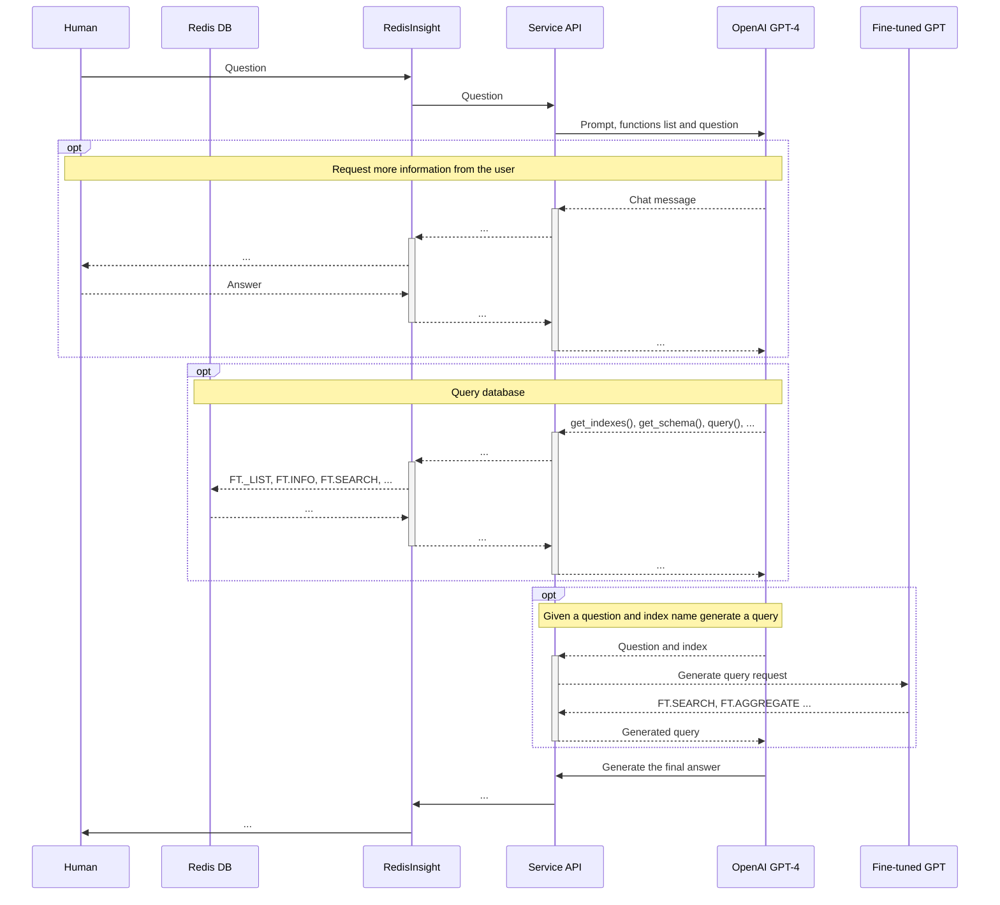

# RediSearch training dataset

This repository consists of the following:

* 'dataset' folder: Q&A items for (t)raining and (v)erification
* 'indices' folder: index setups

## System architecture

```mermaid
sequenceDiagram
  participant U as Human
  participant D as Redis DB
  participant R as RedisInsight
  participant A as Service API
  participant G as OpenAI GPT-4
  participant F as Fine-tuned GPT

  U->>R: Question
  R->>A: Question
  A->>G: Prompt, functions list and question

  opt
    note over G, U: Request more information from the user
    G-->>+A: Chat message
    A-->>+R: ...
    R-->>U: ...
    U-->>R: Answer
    R-->>-A: ...
    A-->>-G: ...
  end

  opt
    note over G, D: Query database
    G-->>+A: get_indexes(), get_schema(), query(), ...
    A-->>+R: ...
    R-->>D: FT._LIST, FT.INFO, FT.SEARCH, ...
    D-->>R: ...
    R-->>-A: ...
    A-->>-G: ...
  end

  opt
    note over G, A: Given a question and index name generate a query
    G-->>+A: Question and index
    A-->>F: Generate query request
    F-->>A: FT.SEARCH, FT.AGGREGATE ...
    A-->>-G: Generated query
  end

  G->>A: Generate the final answer
  A->>R: ...
  R->>U: ...

```